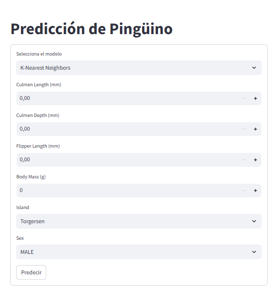

# Predicción de Especies de Pingüinos con FastAPI y Streamlit

## 📌 Descripción del Proyecto

Este proyecto implementa un sistema de predicción de especies de pingüinos utilizando diferentes modelos de Machine Learning. Se ha desarrollado una API utilizando **FastAPI** para realizar la inferencia y un frontend con **Streamlit** para una interfaz interactiva.

Adicionalmente, se ha creado un contenedor **Docker** que expone la API en el puerto **8989** y la interfaz web en el puerto **8501**. Como bono, la API permite seleccionar el modelo a utilizar en la inferencia.

---

## 🛠 Tecnologías Utilizadas

- **🐍 Python 3.12.9**
- **🚀 FastAPI** (Para la creación del API REST)
- **🎨 Streamlit** (Para la interfaz gráfica del usuario)
- **📊 Scikit-learn** (Para entrenamiento de modelos de Machine Learning)
- **🐳 Docker** (Para la contenedorización y despliegue)
- **⚡ Uvicorn** (Para ejecutar FastAPI)
- **💾 Joblib & Pickle** (Para serialización de modelos)

---

## 🚀 Instrucciones de Instalación y Ejecución

### 1️⃣ Clonar el Repositorio
```bash
 git clone <https://github.com/santigonzalez13/ml_deploy_fastapi.git>
 cd <ml_deploy_fastapi/app/backend>
```

### 2️⃣ Construir y Ejecutar el Contenedor Docker

Para construir la imagen del contenedor, ejecutar:
```bash
docker build -t nivel_0 .
```

Para ejecutar el contenedor:
```bash
docker run --name nivel_002 -p 8989:8989 -p 8501:8501 nivel_0
```

Esto iniciará la API en el puerto **8989** y la interfaz de Streamlit en el puerto **8501**.

### 3️⃣ Acceder a la API y a la Interfaz Gráfica

- 📌 **API Docs**: [http://localhost:8989/docs](http://localhost:8989/docs)  
- 🖥 **Interfaz Streamlit**: [http://localhost:8501](http://localhost:8501)

---

## 📂 Estructura del Proyecto
```bash
|-- data/
|   |-- penguins_size.csv   # Dataset utilizado
|
|-- models/
|   |-- modelo1.pkl         # Modelo K-Nearest Neighbors
|   |-- modelo2.pkl         # Modelo Support Vector Machine
|   |-- modelo3.pkl         # Modelo Naive Bayes
|   |-- modelo4.pkl         # Modelo Perceptrón Multicapa
|   |-- column_order.pkl    # Orden de las columnas para inferencia
|
|-- app_streamlit.py        # Interfaz gráfica con Streamlit
|-- main.py                 # API desarrollada con FastAPI
|-- train.py                # Script de entrenamiento de modelos
|-- requirements.txt        # Dependencias del proyecto
|-- Dockerfile              # Archivo de configuración para Docker
|-- README.md               # Documentación del proyecto
```

---

## 🔗 Funcionamiento del API

La API permite realizar inferencias sobre la especie de un pingüino basándose en distintas características. 

### **1️⃣ Inferencia con todos los modelos**
🔹 Devuelve la predicción basada en el modelo con mayor consenso.
   - **📌 Endpoint:** `POST /pinguino`
   - **📩 Entrada:** Datos del pingüino en formato JSON.
   - **📤 Salida:** Predicción de la especie del pingüino.

### **2️⃣ Inferencia con un modelo específico**
🔹 El usuario puede seleccionar el modelo de Machine Learning a utilizar.
   - **📌 Endpoint:** `POST /pinguino/{modelo}`
   - **📩 Entrada:** Datos del pingüino y el nombre del modelo a utilizar.
   - **📤 Salida:** Predicción basada en el modelo seleccionado.

#### **Ejemplo de solicitud JSON:**
```json
{
  "culmen_length_mm": 50.0,
  "culmen_depth_mm": 18.0,
  "flipper_length_mm": 200.0,
  "body_mass_g": 5000,
  "island": "Torgersen",
  "sex": "MALE"
}
```

---

## 🤖 Modelos Implementados

Se han entrenado cuatro modelos de Machine Learning:

- ✅ **K-Nearest Neighbors (modelo1)**
- ✅ **Support Vector Machine (modelo2)**
- ✅ **Naive Bayes (modelo3)**
- ✅ **Perceptrón Multicapa (modelo4)**

Estos modelos han sido entrenados utilizando el dataset de pingüinos y evaluados con una partición de datos de entrenamiento y prueba.

---

## 🎨 Implementación de Streamlit

La aplicación de **Streamlit** permite a los usuarios interactuar con la API de manera visual. Desde la interfaz, el usuario puede:

1️⃣ Ingresar las características de un pingüino.  
2️⃣ Seleccionar el modelo de Machine Learning.  
3️⃣ Obtener la predicción en tiempo real.  

Así deberás ver la interfaz:



---

## 🎖 Cumplimiento del Bono

Este proyecto **cumple con el bono** al proporcionar un endpoint adicional que permite seleccionar cuál modelo será usado en el proceso de inferencia. Esto permite a los usuarios experimentar con diferentes algoritmos de Machine Learning y comparar sus resultados.

---
